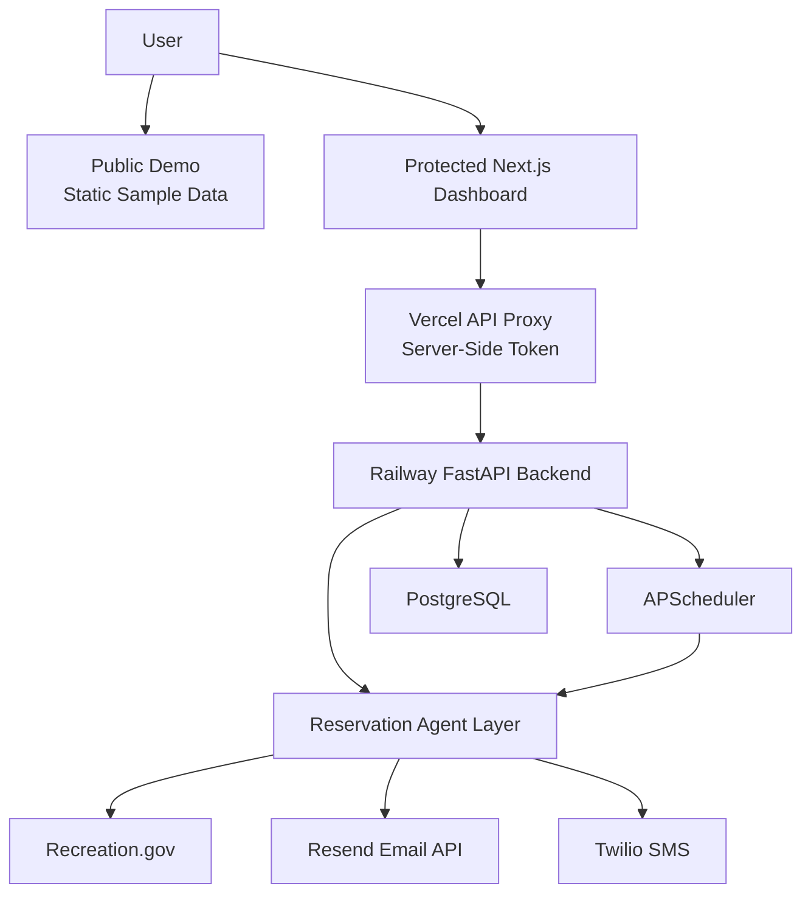

# ParkReserve AI Case Study

## Overview

ParkReserve AI is an autonomous reservation-monitoring platform for U.S. national park campground inventory. It lets a user search Recreation.gov parks and campgrounds, create one or many watches, continuously monitor availability, and receive email/SMS alerts when matching openings appear.

- Live demo: [parkreserve-ai-dashboard.vercel.app/demo](https://parkreserve-ai-dashboard.vercel.app/demo)
- Repository: [github.com/srs312-lab/parkreserve-ai](https://github.com/srs312-lab/parkreserve-ai)
- Stack: Next.js, FastAPI, PostgreSQL, APScheduler, Recreation.gov, Resend, Twilio, Railway, Vercel

## Problem

National park campground reservations disappear quickly, especially at parks like Yosemite, Zion, Glacier, Yellowstone, Rocky Mountain, and Grand Canyon. A traveler often has to manually refresh reservation pages, check multiple campgrounds, and react immediately when cancellations appear.

The real product problem is not just search. It is continuous monitoring, preference matching, alert delivery, and operational confidence.

## Solution

ParkReserve AI turns a user preference into scheduled reservation watches. Each watch stores the park, campground, date window, minimum nights, campsite type, priority, and notification preferences. The backend polls Recreation.gov inventory, detects matching openings, deduplicates repeated results, and sends alerts through Resend and Twilio.

The product has two surfaces:

- A protected production dashboard for real watches and notification actions.
- A public `/demo` route with static sample data and disabled controls for portfolio viewers.

## User Flow

1. Search for a national park, such as Yosemite.
2. Select one or more campgrounds, such as Upper Pines, Lower Pines, and North Pines.
3. Choose date range, site type, minimum nights, alert channel, and priority.
4. Create a batch of watches.
5. Let the scheduler monitor availability in the background.
6. Review alerts, next available dates, delivery health, and watch analytics in the dashboard.

## Architecture

The backend is organized as an agent layer:

- Search Agent: collects campground and availability data.
- Preference Agent: normalizes user watch preferences.
- Decision Agent: ranks and filters matching availability.
- Execution Agent: sends notifications and records delivery outcomes.

## Engineering Highlights

### Batch Watch Creation

The dashboard supports creating multiple campground watches from one park search. This turns a broad user intent, such as "monitor Yosemite for these dates," into several independent scheduled watches.

### Flexible Minimum Nights

Users can alert on shorter openings inside a wider date range. For example, a user searching for two nights can still choose to receive a one-night alert by setting `min_nights` to `1`.

### Priority-Based Polling

Watches can be high, normal, or low priority. High-priority watches check faster; low-priority watches reduce background load. This is a practical compromise between responsiveness and respectful polling.

### Alert Deduplication

Alerts are deduped by watch, facility, campsite, and available date. The same opening does not repeatedly notify the user, but new sites or new dates still generate alerts.

### Delivery Health And Retry

Every alert stores delivery records for email and SMS. The dashboard surfaces success rate, failed channels, and alerts that need retry. Failed or missing deliveries can be retried without recreating the watch.

### Public Demo Isolation

The public `/demo` page uses static sample data. It does not call the real backend, expose private watches, or allow notification actions. This makes the project easy to share while keeping production data protected.

### Production API Protection

The private dashboard is protected by HTTP Basic Auth. Backend routes require `X-Parkreserve-Token`, and the Vercel proxy injects that token server-side. Browser JavaScript never receives the backend token.

## Product Decisions

### Alerting Instead Of Auto-Booking

Auto-booking can cross into payment, policy, and terms-of-service complexity. I kept the product focused on monitoring and alerting so it remains useful without completing purchases automatically.

### Recreation.gov First

Different parks and lodging systems expose inventory differently. The MVP focuses on Recreation.gov campgrounds because it covers many national park use cases and gives the architecture a stable first integration.

### Operational Dashboard Over Landing Page

The first screen is the actual monitoring dashboard, not a marketing page. The goal was to show working systems: watches, scheduled checks, alerts, delivery health, and analytics.

## Tradeoffs

- Faster polling catches openings sooner, but it also increases load and rate-limit risk.
- A simple password gate is enough for a private portfolio deployment, but a SaaS product would need real user accounts and watch ownership.
- Static demo data is safer publicly, but it cannot prove live inventory by itself. The protected dashboard and API show the real integration.
- APScheduler is simple for one deployed backend instance. A larger production system would move scheduled work into a distributed queue.

## What I Would Build Next

- Account login and per-user watch ownership.
- Stripe subscriptions for high-priority monitoring.
- Push notifications.
- Nearby fallback recommendations across parks and campgrounds.
- Trend charts for demand signals and alert volume.
- Additional inventory sources, such as timed-entry permits and backcountry permits.

## Resume Bullet

Built an autonomous reservation-monitoring platform that scans live Recreation.gov campground inventory, persists user watches in PostgreSQL, schedules recurring availability checks, deduplicates openings, and triggers Resend/Twilio alerts through an agent-based FastAPI and Next.js workflow.
